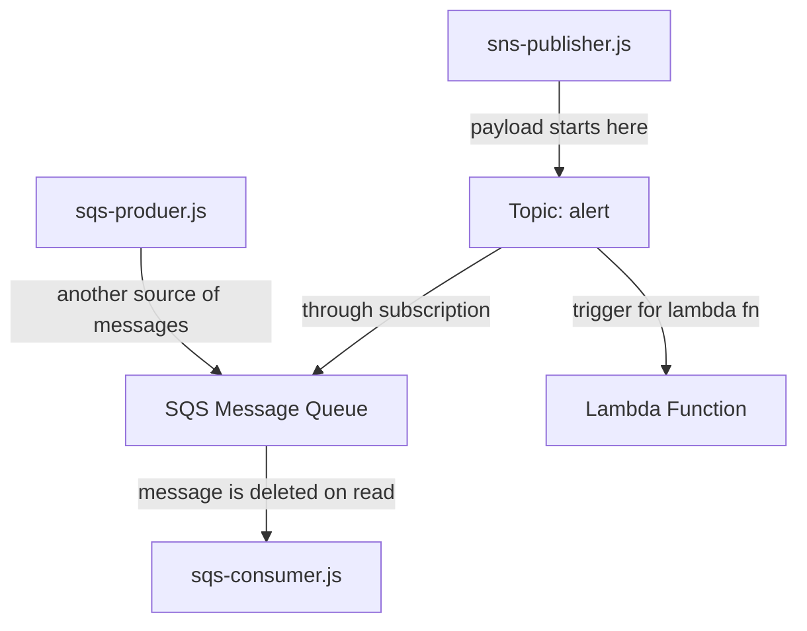

# AWS SNS and SQS dispatch

This is a demo of how to use SNS and SQS to make a dispatch system. In our model we will have a set of vendors, a set of drivers, and a main dispatch. A vendor will send a message to the dispatch. The dispatch will send a message to one of the drivers. 

## AWS services

