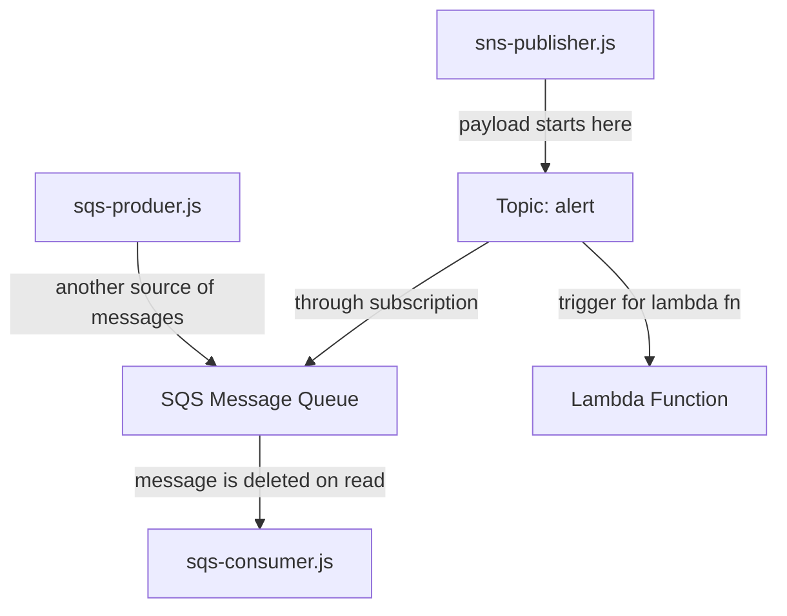

# AWS SNS and SQS dispatch

This is a demo of how to use SNS and SQS to make a dispatch system. In our model we will have a set of vendors, a set of drivers, and a main dispatch. A vendor will send a message to the dispatch. The dispatch will send a message to one of the drivers. 

## AWS services

## How to run

### publishing to an sns topic

Running the v3/sns-publish.js file will publish an SNS message to a FIFO queue on AWS. It can be run from the v3 directory.

    cd v3
    npm install
    npm run sns-publish

This will publish a message to a topic. The topic is subcribed to by a FIFO queue. In this pipeline, all messages will be deduplicated automatically by the service. The message is a delivery notice for an imaginary delivery driver in our scheme. The message will be a `stringified` version of this form:

    {
        orderId: "1234",
        vendorId: "ARN-of-vendor-queue",
        customer: "name of customer"
    }

### consuming messages from an SQS FIFO queue

The v3/sqs-subscriber.js file will run a script that will consume messages from the topic that was just published.  

It can be run with

    npm run sns-subcribe

## Delivery Simulation

The run the delivery simulation, you can use these commands.

`npm run vendor-1-publish` will send a message from vendor to the delivery drivers.

`npm run delivery-driver-respond` will have a "driver" check for a pickup order, and respond that the delivery is ready.

`npm run vendor-1-check-status` will check for any messages from the drivers that the package has been delivered.